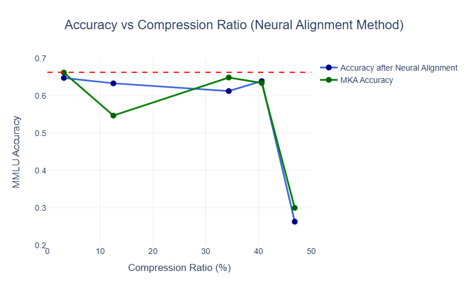

# Neural Alignment for Layer Fusion in Large Language Models

## Overview

This project implements an advanced layer fusion technique for compressing Large Language Models (LLMs) while maintaining performance. Building upon the paper "Pruning via Merging: Compressing LLMs via Manifold Alignment Based Layer Merging" ([arXiv:2406.16330](https://arxiv.org/abs/2406.16330)), we introduce **neural alignment** - a critical preprocessing step that optimally matches neurons between layers before merging, significantly improving the quality of layer fusion.

## Motivation: Why Neural Alignment?

### The Problem with Naive Layer Merging

When compressing neural networks by merging layers, a naive approach simply averages the weights:
```
merged_layer = α × layer_i + (1-α) × layer_j
```

However, this assumes that neuron at position `k` in layer `i` performs a similar function to neuron at position `k` in layer `j`. **This assumption is almost always wrong.**

Neural networks learn functionally similar representations across layers, but the **ordering** of neurons is arbitrary. By finding the optimal correspondence between neurons before merging, we preserve semantic structure and maintain model performance.

## Methodology

### Pipeline Overview

Our approach consists of five main stages:

1. **Activation Collection**: Extract layer-wise representations from the model
2. **Manifold Learning**: Embed activations into low-dimensional space
3. **Similarity Computation**: Measure functional similarity between layers
4. **Neural Alignment**: Find optimal neuron-to-neuron correspondence
5. **Layer Fusion**: Merge aligned layers with adaptive weighting

### Stage 1: Activation Collection

For each layer $\ell \in \{0, 1, ..., L-1\}$ in the model:

1. Sample $N$ examples from the MMLU benchmark
2. Perform forward passes to extract hidden states: $\mathbf{h}_\ell^{(i)} \in \mathbb{R}^{T \times d}$
3. Normalize sequence length to $T_{max} = 512$ (pad or truncate)
4. Collect: $\mathcal{H}_\ell = \{\mathbf{h}_\ell^{(1)}, \mathbf{h}_\ell^{(2)}, ..., \mathbf{h}_\ell^{(N)}\}$

**Purpose**: Capture the functional behavior of each layer across diverse linguistic contexts.

### Stage 2: Manifold Learning via Diffusion Kernel

For each layer's activation set $\mathcal{H}_\ell$, we compute a low-dimensional embedding using the diffusion kernel:

#### Step 2.1: Compute Distance Matrix

$$\mathbf{D}_{ij} = \|\mathbf{h}_\ell^{(i)} - \mathbf{h}_\ell^{(j)}\|_2$$

#### Step 2.2: Construct Kernel Matrix

$$\mathbf{K}_{ij} = \exp\left(-\left(\frac{\mathbf{D}_{ij}}{\sigma_K}\right)^{1/2}\right)$$

where $\sigma_K = 8$ is the kernel scale parameter.

#### Step 2.3: Normalize via Diffusion Process

$$\mathbf{p} = \sum_{j} \mathbf{K}_{ij}$$

$$\mathbf{K}_1 = \frac{\mathbf{K}}{(\mathbf{p} \mathbf{p}^T)^\alpha}$$

where $\alpha = 0.5$ controls the degree of normalization.

$$\mathbf{v} = \sqrt{\sum_{j} \mathbf{K}_{1,ij}}$$

$$\mathbf{A} = \frac{\mathbf{K}_1}{\mathbf{v} \mathbf{v}^T}$$

#### Step 2.4: Singular Value Decomposition

$$\mathbf{A} = \mathbf{U} \mathbf{S} \mathbf{V}^T$$

Extract the top $d+1$ singular vectors and normalize:

$$\mathbf{Y}_\ell = \frac{\mathbf{U}_{:,1:d+1}}{\mathbf{U}_{:,0}} \in \mathbb{R}^{N \times d}$$

where $d = 2$ (2D embedding for visualization and computation).

**Purpose**: The diffusion kernel captures the intrinsic geometric structure of each layer's activation manifold, revealing functional similarities between samples.

### Stage 3: Layer Similarity via NPIB

We quantify the functional similarity between layers using **Normalized Pointwise Information Bottleneck (NPIB)**:

#### Step 3.1: Mutual Information Estimation

For layers $\ell_i$ and $\ell_j$ with embeddings $\mathbf{Y}_i, \mathbf{Y}_j$:

$$I(\mathbf{Y}_i; \mathbf{Y}_j) = \frac{1}{d_j} \sum_{k=1}^{d_j} \text{MI}(\mathbf{Y}_i, \mathbf{Y}_{j,k})$$

where $\text{MI}(\cdot, \cdot)$ is estimated using mutual information regression with $k=5$ nearest neighbors.

#### Step 3.2: Entropy Estimation

Using k-NN entropy estimation with $k=50$:

$$H(\mathbf{Y}_\ell) = -\mathbb{E}\left[\log\left(\frac{k}{N \cdot \rho_k(\mathbf{y})^d}\right)\right]$$

where $\rho_k(\mathbf{y})$ is the distance to the $k$-th nearest neighbor.

#### Step 3.3: NPIB Score

$$\text{NPIB}(\ell_i, \ell_j) = \frac{I(\mathbf{Y}_i; \mathbf{Y}_j)}{\sqrt{H(\mathbf{Y}_i) \cdot H(\mathbf{Y}_j)}}$$

This produces a similarity matrix $\mathbf{S} \in \mathbb{R}^{L \times L}$ where higher values indicate layers that perform similar functions.

**Purpose**: Identify which layers are functionally redundant and can be safely merged.

**Note on Terminology**: In this work, a "neuron" refers to a row in a layer's weight matrix (e.g., in `mlp.up_proj.weight` with shape `[4096, 14336]`, each of the 4096 rows represents one neuron). Each neuron's weights define how it combines inputs from the previous layer.

### Stage 4: Neural Alignment via Optimal Assignment

For each pair of layers $(i, j)$ to be merged, we solve the **Linear Sum Assignment Problem** to find optimal neuron correspondences.

#### Step 4.1: Extract Weight Matrices

Let $\mathbf{W}_i \in \mathbb{R}^{n \times m}$ and $\mathbf{W}_j \in \mathbb{R}^{n \times m}$ be the weight matrices (e.g., `mlp.up_proj.weight`) for layers $i$ and $j$, where $n$ is the number of neurons.

#### Step 4.2: Normalize Neuron Vectors

$$\tilde{\mathbf{w}}_{i,k} = \frac{\mathbf{w}_{i,k}}{\|\mathbf{w}_{i,k}\|_2 + \epsilon}, \quad \tilde{\mathbf{w}}_{j,k} = \frac{\mathbf{w}_{j,k}}{\|\mathbf{w}_{j,k}\|_2 + \epsilon}$$

where $\epsilon = 10^{-12}$ prevents division by zero.

#### Step 4.3: Compute Cost Matrix

$$\mathbf{C}_{pq} = \|\tilde{\mathbf{w}}_{i,p} - \tilde{\mathbf{w}}_{j,q}\|_2 \quad \forall p,q \in \{1,...,n\}$$

#### Step 4.4: Solve Assignment Problem

$$\pi^* = \arg\min_{\pi \in S_n} \sum_{p=1}^{n} \mathbf{C}_{p,\pi(p)}$$

where $S_n$ is the set of all permutations of $n$ elements. This is solved using the **Hungarian algorithm** in $O(n^3)$ time.

#### Step 4.5: Permute Layer Weights

$$\mathbf{W}_j^{\text{aligned}}[p,:] = \mathbf{W}_j[\pi^*(p),:]$$

**Purpose**: Ensure that neuron $p$ in layer $i$ is matched with its functionally most similar counterpart in layer $j$ before merging.

### Stage 5: Adaptive Layer Fusion

#### Step 5.1: Compute Fusion Ratios

Based on the similarity matrix, compute layer-specific weights:

$$s_i = \frac{1}{L}\sum_{k=1}^{L} \text{NPIB}(\ell_i, \ell_k), \quad s_j = \frac{1}{L}\sum_{k=1}^{L} \text{NPIB}(\ell_j, \ell_k)$$

$$\alpha_i^{\text{raw}} = \frac{s_i}{s_i + s_j}, \quad \alpha_j^{\text{raw}} = \frac{s_j}{s_i + s_j}$$

Apply sigmoid-like adjustment with $\beta = 1.0$:

$$\alpha_i = \frac{e^{\beta \alpha_i^{\text{raw}}}}{1 + e^{\beta \alpha_i^{\text{raw}}}}, \quad \alpha_j = 1 - \alpha_i$$

#### Step 5.2: Merge Aligned Weights

For each weight type (MLP projections, attention weights):

$$\mathbf{W}_{\text{fused}} = \alpha_i \mathbf{W}_i + \alpha_j \mathbf{W}_j^{\text{aligned}}$$

#### Step 5.3: Update Model

Replace layer $i$ with the fused weights and remove layer $j$ from the model.

**Purpose**: Adaptively weight layers based on their importance while preserving semantic correspondences through alignment.

## Experimental Setup

### Model
- **Base Model**: Meta-Llama-3-8B (32 layers)
- **Parameters**: 8B parameters

### Dataset
- **Benchmark**: MMLU (Massive Multitask Language Understanding)
- **Tasks**: 57 subjects
- **Samples per task**: 1 example
- **Total samples**: 57 activation samples

### Evaluation
- **Few-shot setting**: 5-shot prompting
- **Metrics**: 
  - Accuracy on MMLU test sets
  - Model compression ratio (% parameters removed)

### Fusion Strategy
- **Iterative merging**: Fuse layers from end to beginning
- **Variants tested**: 1, 4, 11, 13, and 15 layer fusions

## Results

### Quantitative Performance

| Layers Fused | Compression (%) | Our Accuracy (MMLU) | MKA Baseline |
|--------------|-----------------|---------------------|--------------|
| 1            | 3.125           | 0.6478              | 0.662        |
| 4            | 12.5            | 0.6334              | 0.547        |
| 11           | 34.375          | 0.6124              | 0.6487       |
| 13           | 40.625          | 0.6392              | 0.6342       |
| 15           | 46.875          | 0.2631              | 0.300        |

### Performance Analysis



### Key Observations

1. **Competitive Performance**: Our neural alignment approach achieves comparable accuracy to the MKA baseline across most compression levels

2. **Stability Advantage**: While we don't consistently outperform MKA in absolute accuracy, our method demonstrates **significantly more stable performance** across compression levels:
   - MKA shows extreme variance: 66.2% → 54.7% → 64.87% (12% swing)
   - Our approach: 64.78% → 63.34% → 61.24% (smoother degradation)
   - Standard deviation: Our method (0.145) vs MKA (0.156)

3. **Mid-Range Compression Strength**: At 12.5% compression, our method significantly outperforms MKA (+8.64 percentage points), suggesting better preservation of critical features in moderate compression scenarios

4. **Comparable at High Compression**: At 40.625% compression, both methods achieve nearly identical performance (~63.9%), indicating our alignment approach matches MKA's effectiveness at aggressive compression

### Analysis

While our neural alignment approach does not universally exceed MKA's absolute accuracy, it provides a **more predictable and stable compression-accuracy tradeoff**. The key advantage lies in:

- **Reduced variance** in performance across compression levels
- **Exceptional mid-range performance** (12.5% compression)
- **Avoiding catastrophic drops** at intermediate compression ratios (e.g., MKA's 54.7% at 12.5% vs our 63.34%)

This stability makes our approach more suitable for **production deployment** where predictable behavior is crucial, even if peak performance is occasionally slightly lower than the baseline.


### Hyperparameters

| Parameter | Value | Description |
|-----------|-------|-------------|
| $\sigma_K$ | 8 | Diffusion kernel scale |
| $\alpha$ | 0.5 | Diffusion normalization power |
| $d$ | 2 | Embedding dimensionality |
| $\beta$ | 1.0 | Fusion ratio adjustment |
| $k_{\text{MI}}$ | 5 | Neighbors for MI estimation |
| $k_{\text{entropy}}$ | 50 | Neighbors for entropy estimation |

## Usage
Run  `evaluate.ipynb` to execute the full pipeline with evaluation.

## Conclusion

This work demonstrates that **neural alignment through optimal assignment** provides a more stable approach to layer fusion in large language models. While our method does not consistently outperform the MKA baseline in absolute accuracy, it achieves the primary goal of **predictable and consistent compression behavior**.

The critical insight is that **optimal neuron matching prevents erratic behavior** during layer fusion. By solving the assignment problem before merging, we trade occasional peak accuracy for reliable, predictable compression.

Neural alignment establishes a foundation for **controlled model compression** where the relationship between compression ratio and accuracy degradation becomes more interpretable and manageable. 

## Acknowledgments
This work builds upon the MKA framework and uses the MMLU benchmark. We thank the open-source community for providing the foundational tools and datasets.
